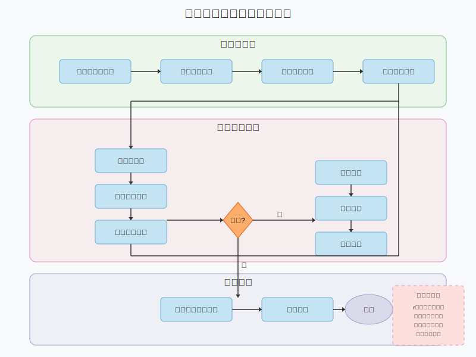

# CipherBreaker - 遗传算法破解单表替换密码

[](https://opensource.org/licenses/MIT)


[English Version](#english-version) | 中文版

> 利用频率分析与遗传算法破解单表替换密码

## 📋 目录

- [项目介绍](#项目介绍)
- [算法原理](#算法原理)
- [安装使用](#安装使用)
- [项目结构](#项目结构)
- [核心代码解读](#核心代码解读)
- [贡献指南](#贡献指南)
- [许可证](#许可证)

## 📖 项目介绍

本项目旨在利用频率分析与遗传算法破解简单替换密码。

简单替换密码是将26个英文字母打乱排序后一一替换原文本的加密方式。例如：

```
原字母顺序：a b c d e f g h i j k l m n o p q r s t u v w x y z
替换后顺序：q w e r t y u i o p a s d f g h j k l z x c v b n m
```

该简单替换密码的密钥即打乱后字母的排列顺序。

## 🧬 算法原理

### 问题分析

目前，替换密码的主要破解方法有频率分析、字母组合分析、字典攻击等。频率分析基于每种自然语言中字母出现频率的规律性，但存在以下局限：
- 需要大量密文样本
- 在区分频率相近的字母时准确度较低
- 后期需要大量人力校验

### 遗传算法结合频率分析

为解决上述问题，本项目将频率分析与遗传算法(Genetic Algorithm, GA)结合使用，提供高效搜索解空间的方法。

遗传算法关键概念：

- **个体**：一组密钥及其对应的适应度
- **染色体**：个体的密钥
- **适应度**：按当前密钥解密后能在词典中找到的单词比例
- **种群**：同一代个体的集合
- **交配**：从种群选取两个个体作为父母，指定结点，结合父母染色体形成新个体
- **变异**：新个体染色体上随机位置的字母可能与相邻字母交换位置

### 算法挑战与解决方案

在实际使用遗传算法时的问题：

1. 变异过程中结点位置字母交换可能导致染色体中同一字母出现两次
2. 结点两侧字母无法交换，可能导致某些字母无法恢复正确位置

解决方案：利用频率分析可知r与d的频率差距明显，将r作为染色体中的结点，确保算法稳定性。

### 算法流程



算法实现步骤：
1. 对密文进行频率分析得到"祖先"
2. 由"祖先"变异得到第一个种群
3. 进行遗传算法迭代直到指定代数
4. 每代记录最佳个体并比较得到全局最佳个体
5. 用全局最佳个体为密文解密

## 🚀 安装使用

### 环境要求
- C语言编译环境

### 使用说明

1. 将待解密的txt格式文本命名为`code.txt`
2. 将txt格式样本文本数据命名为`data.txt`
3. 确保两个文件与可执行文件在同一目录下
4. 运行程序，按提示操作：
   - 按`1`开始解析密码
   - 按`0`退出程序
5. 解密结果将保存在`decode.txt`文件中

### 注意事项

- 样本文本需足够大（至少1000个单词）
- 样本文本数量越大，结果可能越准确
- 程序会自动进行遗传算法迭代，用户无需干预
- 解析过程中会输出每代最佳个体适应度，用于判断解密效果

## 📁 项目结构

```
CipherBreaker/
├── README.md             # 项目说明文档
├── README.assets/        # 文档资源文件夹
│   ├── picture1.png      # 字母频率分析图
│   └── picture2.png      # 算法流程图
├── img/                  # 新增图片资源目录
│   └── algorithm_flow.svg # 算法流程图
├── src/                  # 源代码目录
│   ├── GA.c              # 遗传算法实现
│   ├── GA.h              # 遗传算法头文件
│   └── main.c            # 主程序入口
└── data/                 # 数据文件目录
    ├── code.txt          # 待解密文本
    ├── data.txt          # 样本文本
    └── dictionary.txt    # 词典文件
```

## 🔍 核心代码解读

### 数据结构定义

- `Individual`：表示遗传算法中的个体，包含染色体和适应度
- `Population`：表示种群，包含个体数量和个体数组
- `TrieNode`：字典树节点，用于存储和查找单词

### 主要功能模块

1. **初始化与基本操作**
   - `createNewIndividual`：创建新个体
   - `createAncestor`：创建初始个体（祖先）
   - `DecodeForFitness`：解密文本计算适应度
   - 字典树操作：创建、插入、搜索和释放

2. **适应度计算**
   - `Fitness`：计算个体适应度

3. **遗传操作**
   - `SmallRandomProbability`：生成小概率事件
   - `Mutate`：变异操作
   - `Mating`：交配操作

4. **种群操作**
   - `createTheFirstGroup`：创建初始种群
   - `Random_Selection`：随机选择个体
   - 种群管理：创建、释放、添加个体等
   - `Generate_next_generation`：生成下一代种群

5. **解密过程**
   - `Decode`：使用最佳个体解密密文

6. **主程序**
   - `Genetic_Algorithm`：遗传算法主过程
   - `main`：程序入口

## 👥 贡献指南

欢迎贡献代码或提出建议，请遵循以下步骤：

1. Fork 本仓库
2. 创建新分支 (`git checkout -b feature/AmazingFeature`)
3. 提交更改 (`git commit -m 'Add some AmazingFeature'`)
4. 推送到分支 (`git push origin feature/AmazingFeature`)
5. 开启 Pull Request

## 📄 许可证

本项目采用 MIT 许可证 - 详情参见 [LICENSE](LICENSE) 文件

---

## English Version

# CipherBreaker - Breaking Single Table Substitution Ciphers with Genetic Algorithms

> Using frequency analysis and genetic algorithms to break single table substitution ciphers

## Table of Contents

- [Introduction](#introduction)
- [Algorithm Principles](#algorithm-principles)
- [Installation & Usage](#installation--usage)
- [Project Structure](#project-structure)
- [Core Code Overview](#core-code-overview)
- [Contributing](#contributing)
- [License](#license)

## Introduction

This project aims to break simple substitution ciphers using frequency analysis and genetic algorithms.

A simple substitution cipher replaces each letter in the plaintext with a different letter in the ciphertext. For example:

```
Original alphabet: a b c d e f g h i j k l m n o p q r s t u v w x y z
Substituted:       q w e r t y u i o p a s d f g h j k l z x c v b n m
```

The key for this cipher is the order of the substituted alphabet.

## Algorithm Principles

### Problem Analysis

Current methods for breaking substitution ciphers include frequency analysis, letter combination analysis, and dictionary attacks. Frequency analysis has limitations:
- Requires large amounts of ciphertext
- Low accuracy when distinguishing letters with similar frequencies
- Requires significant manual verification

### Combining Genetic Algorithms with Frequency Analysis

This project combines frequency analysis with genetic algorithms (GA) to efficiently search the solution space.

Key concepts:

- **Individual**: A key and its corresponding fitness
- **Chromosome**: The individual's key
- **Fitness**: Proportion of words that can be found in a dictionary after decryption
- **Population**: A collection of individuals of the same generation
- **Mating**: Selecting two individuals as parents and combining their chromosomes
- **Mutation**: Random exchange of adjacent letters in a chromosome

### Implementation Flow


1. Perform frequency analysis on the ciphertext to create an "ancestor"
2. Generate the first population through mutations of the ancestor
3. Run the genetic algorithm until a specified number of generations
4. Record the best individual in each generation and compare to find the global best
5. Decrypt the ciphertext using the chromosome of the global best individual

## Installation & Usage

### Requirements
- C compiler environment

### Instructions

1. Name the encrypted text file as `code.txt`
2. Name the sample text data file as `data.txt`
3. Place both files in the same directory as the executable
4. Run the program and follow the prompts:
   - Press `1` to start decryption
   - Press `0` to exit
5. Decryption results will be saved in `decode.txt`

### Notes

- Sample text should be sufficiently large (at least 1000 words)
- Larger sample text may produce more accurate results
- The program automatically performs genetic algorithm iterations
- The program outputs the fitness of the best individual in each generation

## Project Structure

```
CipherBreaker/
├── README.md             # Project documentation
├── README.assets/        # Documentation resources
│   ├── picture1.png      # Letter frequency analysis
│   └── picture2.png      # Old algorithm flow chart
├── img/                  # New image resources directory
│   └── algorithm_flow.svg # Algorithm flow chart
├── src/                  # Source code
│   ├── GA.c              # Genetic algorithm implementation
│   ├── GA.h              # Genetic algorithm header file
│   └── main.c            # Main program entry
└── data/                 # Data files
    ├── code.txt          # Text to decrypt
    ├── data.txt          # Sample text
    └── dictionary.txt    # Dictionary file
```

## Core Code Overview

The implementation includes data structures for individuals, populations, and a trie for the dictionary, along with functions for initialization, fitness calculation, genetic operations, population management, and the decryption process.

## Contributing

Contributions are welcome! Please:

1. Fork the repository
2. Create a feature branch
3. Commit your changes
4. Push to the branch
5. Open a Pull Request

## License

This project is licensed under the MIT License - see the [LICENSE](LICENSE) file for details.

